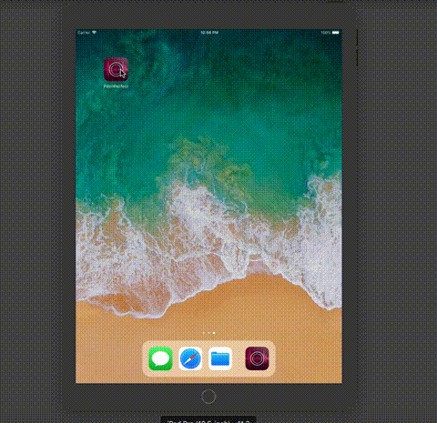
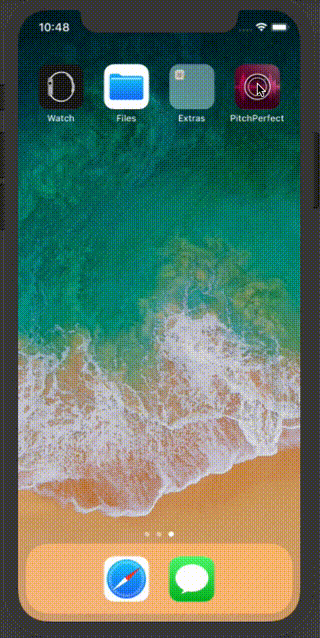

# Portfolio Sample iOS App: Pitch Perfect

- Record and play around with audio effects.
- Uses AVFoundation framework.
- Handles audio interruptions.
- Audio effects are selected by the rotatory wheel.
- Audio effects are scaled by the circular slider.

## Requirements

- Built with Swift 3.3 and Xcode 9.3.1.
- CocoaPods
- Not required but design assets managed by PaintCode.

## Output

